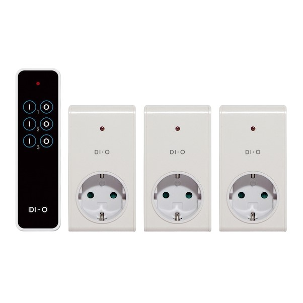

# What is this?
Do you have one of these electrical outlets?



They are extremely cheap and come with a nice fancy remote control. Aaand... That's it. Want to extend it's capabilities? Sorry, not today.

I wanted to be able to switch them on and off remotely using Homeassistant and ESPHome. They work via RF radio but use a currently unsupported protocol known as KaKu. 

Amazing [Randy Simons, AKA 1technophile](https://github.com/1technophile) made [this library](https://github.com/1technophile/NewRemoteSwitch) which does support it. I just cannibalized the library and used the relevant files here.

# How to install

1º - In ESPHome, create a new node and append

```
switch:
- platform: custom
  lambda: |-
    auto switch0 = new MyCustomSwitch(int(0));
    App.register_component(switch0);
    auto switch1 = new MyCustomSwitch(int(1));
    App.register_component(switch1);
    auto switch2 = new MyCustomSwitch(int(2));
    App.register_component(switch2);
    return {switch0, switch1, switch2};

  switches:
    - name: "Switch 1"
    - name: "Switch 2"
    - name: "Switch 3"
```

also add this to the `esphome:` section:

```
  includes:
    - NewRemoteTransmitter.h
    - NewRemoteTransmitter.cpp
    - diio.h
```

save the file.

2º - Browse to the place where the configuration file is (I'd say config/esphome) and copy the contents of the `files` folder.

3º - Compile and upload as usual in ESPHome.

Done!

# How to use

The device should simply show in Homeassistant with three switches. Please mind that if you switch the outlets using the remote, Homeassistant won't know they have changed state. This is because there is no feedback from the outlet (it's not meant to).

# To do

There is a fourth button on the remote that turns all the switches on/off. That's a group bit and it's supported by the NewRemoteSwitch library. Task: Make it a switch also on ESPHome.

# Acknowledgments

  * [Randy Simons, AKA 1technophile](https://github.com/1technophile) for the NewRemoteSwitch library